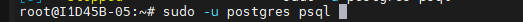

## ATIVIDADE BANCO DE DADOS STREAMING

1- Primeiro entramos no postgresql.

2-Após entramos no postgres criamos o nosso banco de dados do streaming

e vemos se ele realmente foi criado certinho usando o comando "l".

3- Agora entramos no VsCode e na extensao PostgreSQL explorer, aonde reentramos usando nosso ip e damos um refresh para aparecer o "betaflix".

4-Já na extensão damos o comando CREATE TABLE para criar a base do banco de dados o catalogo aonde vão ficar as informações do filme

comentamos o código passado, e já verificamos se tudo ficou como queriamos apertando f5 e usando o comando SELECT.

5-Agora preenchemos a tabela usando o INSERT INTO, colocando 21 filmes e séries

e verificamos novamente 

vemos que o Corações de Ferro se repetiu e o apagamos pelo id para ficar só um dele

e vemos que realmente deu certo

5- Agora para vermos os 10 melhores filmes e séries usamos o SELECT * FROM e só filtramos as maiores notas e os 10 melhores

e como podemos ver realmente deu certo e retornou os 10 melhores.

6- Agora alteramos a nota de alguns deles para 10, do id 1 ao 5 utilizamos o IN para facilitar nossa vida e não precisar colocar vários OR 

e agora vemos que do id 1 ao 5 realmente todos estão com nota 10.

7- Agora apagaremos do id 1 ao 5 

E vemos que agora os filmes começam no id 6 por termos apagado até o 5.

*e essa foi atividade STEAMING da aula/semana 5*
