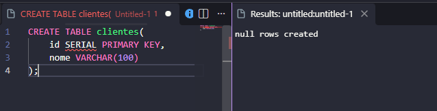
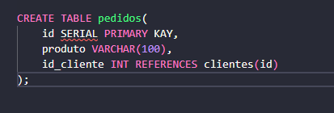
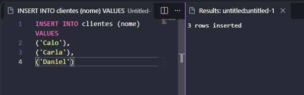
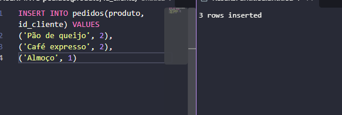
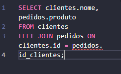

# AULA -Relacionamento de Tabelas

## Ideia Principal 0
-**Clientes:** Quem compra.
-**Pedidos:** Aquilo que foi vendido.
-Cada pedido guarda o **número do cliente** (id), não o seu nome.
-O **Join** junta duas tabelas para mostrar o nome do cliente do lado de seu pedido.

## Diagrama
```mermaid
erDiagram
    CLIENTES  ||--o{
    PEDIDOS : faz
    }
    CLIENTES{
        int id PK
        varchar nome
        int id_cliente 
        FK 
    }
```

**PK:** O número que identifica cada cliente e cada pedido.
**FK**: (Chave estrangeira) O número que irá apontar para a outra tabela.
- ||--o

## Passo a passo

1-Criamos a tabela de clientes: 



2- Criamos a Tabela de pedidos (criando com a chave estrangeira):



3- Inserimos o nome dos clientes ( Daniel não vai inserir nada na coluna, não vai pedir algo):


4-Inserimos os produtos para nossos clientes:


5- O daniel não aparece porque ele não possui pedido algum
]

6- Utilizando o comando LEFT


O LEFT: mostra tudo da tabela da esqquerda (basicamente, É A TABELA APÓS O FROM).