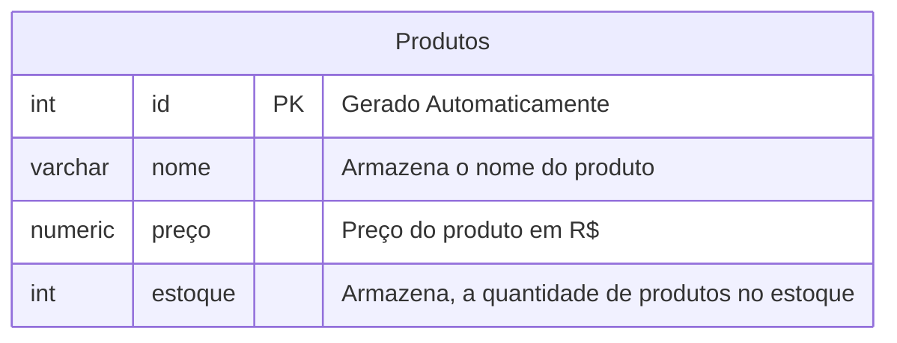

## AULA 04

Para excluir o bano de dados, utilizamos o comando:

```sql
DROP DATABASE cidade;
```
>Cuidado ma operação
---

Primeiro iniciamos o processo criando o banco de dados:
```sql 
CREATE DATABASE lojalv;
```

**Modelando oprimeiro banco de dados**


Paraca crição do banco de dados uilizamos os seguintes comandos: 
```sql
CREATE TABLE produtos(
    id INT GENERATED ALWAYS AS IDENTITY NOT NULL, 
    nome VARCHAR(50) NOT NULL,
    preço NUMERIC(10,2) NOT NULL,
    estoque INT NOT NULL DEFAULT 0 
);
```
Para consultar todos os dados da tabela
```sql
SELECT * FROM produtos;
```

Para inserir valores a tabela usamos
```sql
INSERT INTO produtos(nome,preço,estoque)
VALUES('Chuveiro','100','20');
```
